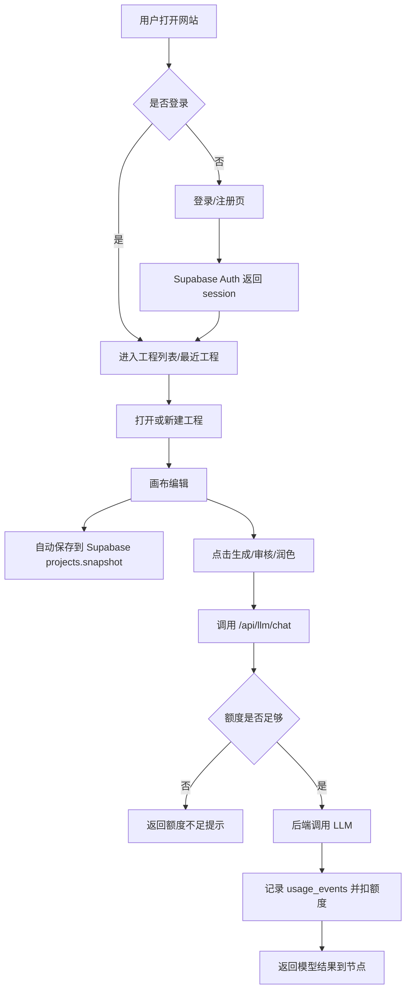

# Studio Canvas SaaS MVP 技术方案

目标：把当前本地/桌面工具升级为可在线登录、可云端保存、可安全调用 LLM、可后续收费的轻量网站版。第一版不急着接支付，先完成“用户能在线稳定使用”的闭环。

## 1. MVP 边界

第一版必须包含：

- 用户登录/退出。
- 每个用户只能看到自己的工程。
- 工程可云端保存、读取、重命名、删除。
- 刷新网页后可以恢复最近工程。
- 提示词生成、审核节点、文本润色全部走后端 LLM 代理。
- 后端记录每次 LLM 调用和额度消耗。
- 免费额度可人工发放和调整。

第一版暂不包含：

- 自动支付。
- 团队协作。
- 实时多人编辑。
- 模板市场。
- 复杂后台管理系统。

## 2. 推荐技术栈

最轻落地路线：

- 前端部署：Vercel，继续使用现有 React + Vite。
- 后端 API：Vercel Serverless Functions，放在同一个仓库的 `api/` 目录。
- 登录和数据库：Supabase Auth + Supabase Postgres。
- 文件/导出：先保留浏览器本地下载，后续再接 Supabase Storage。
- 支付：第二阶段再接 Stripe Checkout 或国内支付。

原因：

- 当前项目已经是 Vite 前端，迁移成本低。
- Vercel 可以同时托管静态前端和轻量 API。
- Supabase 能一次解决登录、数据库、RLS 权限和项目存储。
- 先不自建 Node 服务，减少服务器维护成本。

## 3. 当前代码映射

现有可复用模块：

- `src/services/ModelGateway.ts`：已有代理 URL 机制，可迁移到 `/api/llm/chat`。
- `src/services/llmJsonClient.ts`：现有 JSON 解析、修复、流式回退逻辑可保留。
- `src/services/studioProjectPersistence.ts`：现有 IndexedDB 工程结构可作为云端 `projects.snapshot` 数据格式。
- `src/store/slices/projectStore.ts`：现有 `hydrateProject` 可复用为云端项目恢复入口。
- `src/store/useStudioStore.ts` 和拆分 slices：后续只需要增加 auth/cloud project 状态，不需要重写画布核心。

需要迁移的点：

- 前端不能再保存正式 LLM API Key。
- `.env.local` 中的 `VITE_LLM_API_KEY` 只能用于本地开发，网站生产环境必须禁用。
- LLM 请求统一改为 `VITE_LLM_PROXY_URL=/api/llm/chat`。
- 本地 IndexedDB 仍可保留为离线草稿/兜底缓存，但云端工程要成为主存储。

## 4. 用户流程



## 5. 数据库设计

Supabase 表建议：

### profiles

保存用户基础信息和套餐状态。

```sql
create table profiles (
  id uuid primary key references auth.users(id) on delete cascade,
  email text,
  display_name text,
  plan text not null default 'free',
  created_at timestamptz not null default now(),
  updated_at timestamptz not null default now()
);
```

### credit_wallets

保存用户额度。第一版可以只用次数，不必先精确 token 计费。

```sql
create table credit_wallets (
  user_id uuid primary key references auth.users(id) on delete cascade,
  monthly_quota int not null default 30,
  remaining_quota int not null default 30,
  reset_at timestamptz,
  updated_at timestamptz not null default now()
);
```

### projects

保存云端工程。`snapshot` 直接复用当前导出 JSON 结构。

```sql
create table projects (
  id uuid primary key default gen_random_uuid(),
  user_id uuid not null references auth.users(id) on delete cascade,
  name text not null default '未命名工程',
  snapshot jsonb not null,
  created_at timestamptz not null default now(),
  updated_at timestamptz not null default now(),
  archived_at timestamptz
);

create index projects_user_updated_idx on projects(user_id, updated_at desc);
```

### usage_events

记录 LLM 调用，便于查成本和排查失败。

```sql
create table usage_events (
  id uuid primary key default gen_random_uuid(),
  user_id uuid not null references auth.users(id) on delete cascade,
  project_id uuid references projects(id) on delete set null,
  feature text not null,
  model text,
  input_chars int not null default 0,
  output_chars int not null default 0,
  estimated_tokens int not null default 0,
  quota_cost int not null default 1,
  status text not null default 'success',
  error_message text,
  created_at timestamptz not null default now()
);

create index usage_events_user_created_idx on usage_events(user_id, created_at desc);
```

### subscriptions

先预留，第二阶段接支付。

```sql
create table subscriptions (
  user_id uuid primary key references auth.users(id) on delete cascade,
  provider text,
  provider_customer_id text,
  provider_subscription_id text,
  status text not null default 'inactive',
  current_period_end timestamptz,
  updated_at timestamptz not null default now()
);
```

## 6. RLS 权限

必须开启 Row Level Security。

核心规则：

- `projects.user_id = auth.uid()` 才能读写。
- `profiles.id = auth.uid()` 才能读取自己的 profile。
- `credit_wallets.user_id = auth.uid()` 只允许读，不允许用户直接改额度。
- `usage_events.user_id = auth.uid()` 只允许读。
- 扣额度和写 usage 由后端 API 使用 service role 完成。

## 7. API 设计

### `POST /api/llm/chat`

职责：

- 校验 Supabase session。
- 检查用户额度。
- 限制请求大小。
- 调用真实 LLM。
- 记录 usage。
- 扣减 quota。
- 返回 OpenAI-compatible 响应或当前前端需要的格式。

当前实现位置：`api/llm/chat.ts`。

已实现：

- 校验 Supabase 登录 token。
- 检查 `credit_wallets.remaining_quota`。
- 调用服务端 `LLM_BASE_URL` / `LLM_API_KEY`。
- 成功后写入 `usage_events` 并扣减额度。
- 失败时写入失败 usage，并清理错误信息里的敏感 Key。
- 前端启用 Supabase + `VITE_LLM_PROXY_URL` 后强制走代理，避免旧本地设置绕过后端。

待增强：

- 扣额度改成数据库 RPC，避免高并发下余额竞争。
- 流式响应改成真正边生成边透传。
- 根据具体节点传入 `feature`，让用量统计更精确。

### `GET /api/credits/status`

当前实现位置：`api/credits/status.ts`。

职责：

- 校验 Supabase 登录 token。
- 读取 `profiles.plan`。
- 读取 `credit_wallets.monthly_quota`、`remaining_quota`、`reset_at`。
- 返回给前端右上角额度状态条。

前端实现：

- `src/services/creditService.ts`：读取额度状态，并暴露 `studio-credit-refresh` 刷新事件。
- `src/components/CreditStatusPill.tsx`：登录后显示当前套餐和剩余额度。
- `src/services/ModelGateway.ts`：网站代理生成成功后自动触发额度刷新。

### `GET /api/health`

当前实现位置：`api/health.ts`。

职责：

- 检查 Vercel 后端环境变量是否齐全。
- 只返回布尔值，不返回任何密钥内容。
- 用于部署后快速确认 Supabase 和 LLM 上游是否配置完成。

部署联调清单：`docs/vercel-supabase-deploy.md`。

## 本地 Mock 模式

当前实现：

- `VITE_SAAS_MOCK=true` 时启用。
- `src/services/authClient.ts` 会模拟登录，不需要 Supabase。
- `src/services/cloudProjectService.ts` 会把云端工程写入 `localStorage`，不访问 `/api/projects`。
- `src/services/creditService.ts` 会提供本地模拟额度，默认 `30/30`。
- `src/services/ModelGateway.ts` 在 Mock 模式下生成成功后会模拟扣 1 次额度。
- Mock 模式不会强制使用 `VITE_LLM_PROXY_URL`，所以本地仍可用原来的 Base URL/API Key 测试生成。

用途：

- 在真实 Supabase/Vercel 配置前，先验证网站版登录页、账号条、额度条、云端工程入口和保存/打开交互。

请求示例：

```json
{
  "feature": "prompt-generate",
  "projectId": "uuid",
  "model": "gpt-5.5",
  "messages": [
    { "role": "system", "content": "..." },
    { "role": "user", "content": "..." }
  ],
  "jsonMode": true,
  "temperature": 0.3,
  "maxOutputTokens": 2500
}
```

后端需要保护：

- 禁止未登录访问。
- 禁止前端传任意 Base URL。
- 禁止前端传 API Key。
- 限制单次输入长度。
- 限制并发和频率。
- 捕获上游错误，不把 API Key 泄露到错误信息中。

### `GET /api/projects`

返回当前用户工程列表。

### `POST /api/projects`

创建工程。

### `GET /api/projects/:id`

读取工程 snapshot。

### `PUT /api/projects/:id`

保存工程 snapshot。

### `DELETE /api/projects/:id`

软删除工程，写入 `archived_at`。

当前实现位置：

- `api/projects/index.ts`
- `api/projects/[id].ts`

已实现：

- 校验 Supabase 登录 token。
- 使用 Service Role 访问数据库，但每次都显式按 `user_id` 过滤。
- 限制单个工程 snapshot 最大约 5 MB。
- 支持云端工程列表、新建、读取、保存、软删除。
- 前端 `src/services/cloudProjectService.ts` 已切换为调用 `/api/projects`，不再由浏览器直接写 Supabase `projects` 表。

## 8. 前端改造点

新增模块：

- `src/services/authClient.ts`：Supabase client、登录、退出、获取 session。
- `src/services/cloudProjectService.ts`：云端工程 CRUD。
- `src/store/slices/authStore.ts`：用户信息、登录状态、套餐状态。
- `src/components/AuthGate.tsx`：未登录显示登录页，已登录进入画布。
- `src/components/ProjectCloudPanel.tsx`：工程列表、云端保存、打开最近工程。

修改模块：

- `src/App.tsx`：网站版包一层 `AuthGate`，桌面版仍由 `LicenseGate` 处理。
- `src/services/ModelGateway.ts`：生产环境优先使用 `/api/llm/chat`。
- `src/services/studioProjectPersistence.ts`：保留 IndexedDB，同时增加 cloud adapter。
- `src/components/StudioProjectMenu.tsx`：增加云端保存/打开入口。

建议状态优先级：

1. 登录后优先读云端最近工程。
2. 如果云端失败，提示用户是否恢复本地 IndexedDB 自动保存。
3. 未登录状态不允许生成提示词，只允许查看欢迎页或演示页。

## 9. 额度策略

第一版简单按次数扣费：

- 文本润色：1 次。
- 单镜头提示词：1 次。
- 多镜头组合提示词：2 次。
- 审核节点 LLM 调整：1 次。
- JSON 修复重试：不额外扣费。

后续再改为 token 成本：

- `estimated_tokens = ceil((input_chars + output_chars) / 2)`
- 不同模型设置不同倍率。

免费额度建议：

- 免费用户：每月 50 次。
- 内测用户：手动给 300-1000 次。
- Pro 用户：每月 2000 次或更高。

## 10. 部署环境变量

前端公开变量：

```text
VITE_SUPABASE_URL=
VITE_SUPABASE_ANON_KEY=
VITE_LLM_PROXY_URL=/api/llm/chat
```

后端私密变量：

```text
SUPABASE_URL=
SUPABASE_ANON_KEY=
SUPABASE_SERVICE_ROLE_KEY=
LLM_BASE_URL=
LLM_API_KEY=
LLM_MODEL=gpt-5.5
LLM_FAST_MODEL=gpt-5.5
LLM_DEEP_MODEL=gpt-5.5
```

注意：`LLM_API_KEY` 和 `SUPABASE_SERVICE_ROLE_KEY` 只能放在 Vercel 后端环境变量里，不能以 `VITE_` 开头。

## 11. 实施顺序

### 第 0 步：准备

- 创建 Supabase 项目。
- 建表并开启 RLS。
- 创建 Vercel 项目。
- 配好环境变量。

### 第 1 步：登录壳

- 加 Supabase client。
- 加 `AuthGate`。
- 支持邮箱登录或魔法链接。
- 登录后进入现有画布。

验收：

- 未登录看不到主工具。
- 登录后可以进入画布。
- 刷新后登录状态保持。

### 第 2 步：云端工程

- 新建工程写入 `projects`。
- 手动保存写入 `snapshot`。
- 打开工程调用 `hydrateProject`。
- 工程列表按更新时间排序。

验收：

- A 用户看不到 B 用户工程。
- 刷新网页后能恢复最近工程。
- 导出的本地 JSON 结构和云端 snapshot 兼容。

### 第 3 步：LLM 代理

- 新增 `/api/llm/chat`。
- 前端 `ModelGateway` 改为调用代理。
- 后端调用 LLM。
- 写入 usage 并扣额度。

验收：

- 浏览器 DevTools 看不到真实 LLM API Key。
- 免费额度为 0 时不能生成。
- 模型错误不会泄露 Key。

### 第 4 步：额度和运营

- 前端显示剩余额度。
- 额度不足弹出升级提示。
- 暂时用 Supabase 表手动给用户加额度。

验收：

- 每次生成后额度减少。
- 后台能查到用户调用记录。

### 第 5 步：支付

- 接 Stripe Checkout 或国内支付。
- 支付成功后更新 `subscriptions` 和 `credit_wallets`。
- 增加套餐页。

## 12. 风险和处理

- 风险：LLM 成本不可控。
  处理：先做次数额度、请求大小限制、并发限制。

- 风险：项目 snapshot 太大。
  处理：第一版限制单工程大小，比如 5 MB；后续大文件转 Storage。

- 风险：用户误刷新丢内容。
  处理：本地 IndexedDB + 云端自动保存双保险。

- 风险：RLS 配错导致数据串号。
  处理：所有表先写最小权限策略，并用两个测试账号验证。

- 风险：前端仍可配置自定义 LLM Key。
  处理：网站生产环境隐藏自定义 Key 配置，只保留后端代理。

## 13. 第一轮开发清单

建议我们下一轮直接做这些文件：

- 新增 `src/services/authClient.ts`
- 新增 `src/services/cloudProjectService.ts`
- 新增 `src/components/AuthGate.tsx`
- 新增 `src/store/slices/authStore.ts`
- 新增 `api/llm/chat.ts`
- 新增 `api/projects/index.ts`
- 新增 `api/projects/[id].ts`
- 修改 `src/App.tsx`
- 修改 `src/services/ModelGateway.ts`
- 修改 `src/components/StudioProjectMenu.tsx`
- 新增 `docs/supabase-schema.sql`

推荐先从登录和云端项目开始，不要一上来动提示词生成管线。只要账号和工程保存先跑通，后端 LLM 代理就能很稳地接上。
